# Lead Intake & Follow-Up Automation

An AI-powered lead intake and follow-up pipeline, built end to end as a solo project around a realistic scenario: a small studio ("Bloom Studio," a fictional client) that wants every inquiry validated, triaged by AI, answered personally, and followed up automatically.

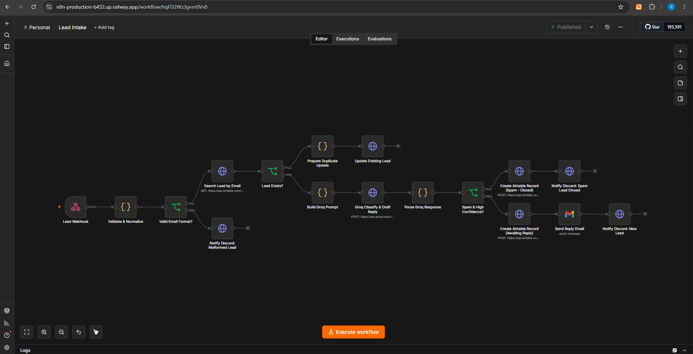

## Live demo

The landing page is live at **[bloomstudio-leads.vercel.app](https://bloomstudio-leads.vercel.app/)**. Submit the form with a real message and you'll get a personalized reply by email within moments.

The automation engine behind it is a self-hosted n8n instance running on Railway. It isn't meant for public browsing (it's the backend, not the demo), but every workflow it runs is documented in detail below and in [docs/architecture.md](docs/architecture.md).

## What it does

1. A visitor fills out the contact form with their name, email, project details, and budget range.
2. The system checks whether this person has reached out before, so returning visitors never get treated as a brand new lead.
3. An AI assistant reads the message, figures out what kind of inquiry it is (sales, support, partnership, or spam), and drafts a warm, personalized reply.
4. Every lead is saved to a shared CRM board, so the team always has a running record of who reached out and when.
5. The visitor receives their personalized reply by email within moments, and the team gets a Discord notification so nobody misses a new lead.
6. If a lead goes quiet for a few days, the system automatically sends a friendly check-in, so no inquiry falls through the cracks.

## Architecture

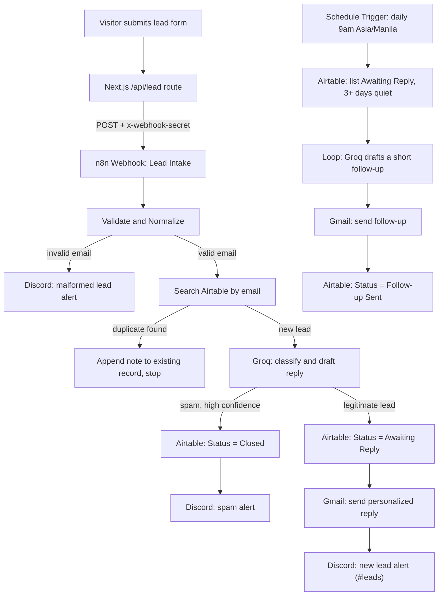

## Stack

| Layer | Tool | Why |
|---|---|---|
| Landing page | Next.js 14 (App Router), TypeScript, Tailwind CSS | Fast to build, deploys cleanly on Vercel |
| Automation engine | n8n (self-hosted on Docker, deployed to Railway) | Full control over workflow logic, a tool widely used for this kind of automation work |
| AI | LLM API (OpenAI-compatible chat completions) - implemented with Groq | Fast inference, generous free tier, drop-in OpenAI-compatible request format |
| CRM / database | Airtable | Proper REST API, familiar spreadsheet-like interface for a non-technical business owner |
| Email | Gmail API (OAuth2) | Standard for small businesses; demonstrates OAuth2 credential handling |
| Notifications | Discord webhooks | Simple incoming-webhook setup, no bot infrastructure needed |

## Key engineering decisions

**Two-layer validation.** The form validates with Zod in the browser for instant feedback, but the n8n webhook is a real public endpoint: anyone can POST to it directly, bypassing the form entirely. So the Code node inside n8n re-validates the shared secret and the email format independently of the frontend. Client-side validation is a UX convenience, not a security boundary, and the workflow never trusts it.

**Webhook secret authentication.** The Next.js API route proxies the request so the real n8n webhook URL never reaches the browser, and every forwarded request carries a shared `x-webhook-secret` header that the n8n Code node checks first. The webhook still responds `200` immediately regardless of whether the secret matched, so a failed auth attempt doesn't leak any signal to whoever is probing it. The workflow itself fails internally and shows up in the executions log for review.

**Raw Airtable REST via HTTP Request nodes, not the native Airtable node.** Every Airtable interaction in this project (search, create, update) goes through plain HTTP Request nodes calling Airtable's REST API directly, rather than n8n's built-in Airtable node. This keeps the exact request shape fully visible and version-independent in the workflow JSON, rather than depending on a specific node build's internal field names, and it makes the whole integration portable across n8n versions and self-hosted instances.

**Safe JSON parsing with an unclassified fallback.** Groq is asked for strict JSON, but no LLM output is guaranteed clean on every call. The parsing Code node strips common markdown code-fence wrapping, attempts `JSON.parse` in a try/catch, and falls back to a safe `unclassified` category with empty defaults rather than letting the workflow crash. A lead is always saved to Airtable, even if the AI step has a bad response, so no inquiry is ever silently lost.

**Status-based send guard for follow-ups.** The follow-up workflow doesn't track "have I already sent a follow-up" with a separate flag. It simply queries Airtable for records where `Status` is still exactly `Awaiting Reply`. The moment a follow-up goes out, `Status` flips to `Follow-up Sent`, which naturally excludes that record from every future daily run. No extra dedupe bookkeeping required.

## Deployment gotchas

Real issues hit while building and deploying this, and how they were fixed:

- **n8n no longer supports classic env-based basic auth.** Newer n8n builds require creating an owner account through the editor UI on first load instead of honoring `N8N_BASIC_AUTH_ACTIVE`. The docker-compose file doesn't set those variables for this reason.
- **`N8N_BLOCK_ENV_ACCESS_IN_NODE`.** By default, newer n8n versions block Code and HTTP Request nodes from reading `$env` at all, for security. Every node in this project that reads `$env.WEBHOOK_SECRET`, `$env.AIRTABLE_PAT`, `$env.GROQ_API_KEY`, or the Discord webhook URLs would throw "access to env vars denied" until this was explicitly set to `false`.
- **Airtable's select fields use Title Case options.** Writing a lowercase category like `spam` failed with "insufficient permissions to create new select option," because the Category field's real options are Title Case (`Spam`, `Sales`, and so on) and the API token isn't permitted to silently create new ones. Fixed by capitalizing the first letter before writing.
- **Railway volume permissions.** The persistent volume mounted at `/home/node/.n8n` hit an `EACCES` permissions error on Railway's container runtime. Fixed by setting `RAILWAY_RUN_AS_ROOT=true`.
- **Credentials don't travel in workflow exports.** n8n's workflow JSON export never includes actual OAuth tokens, only a credential ID and name reference. Every environment, local and production, needs its own Gmail OAuth2 credential created and manually reselected on the relevant nodes after importing a workflow.

## Screenshots

**Landing page**
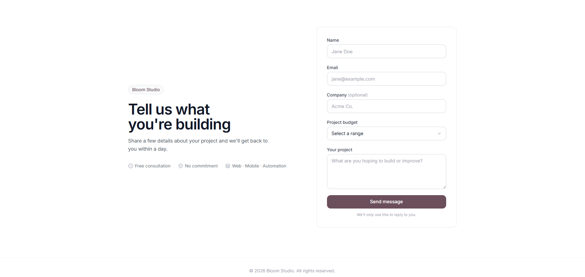

**Webhook validation**
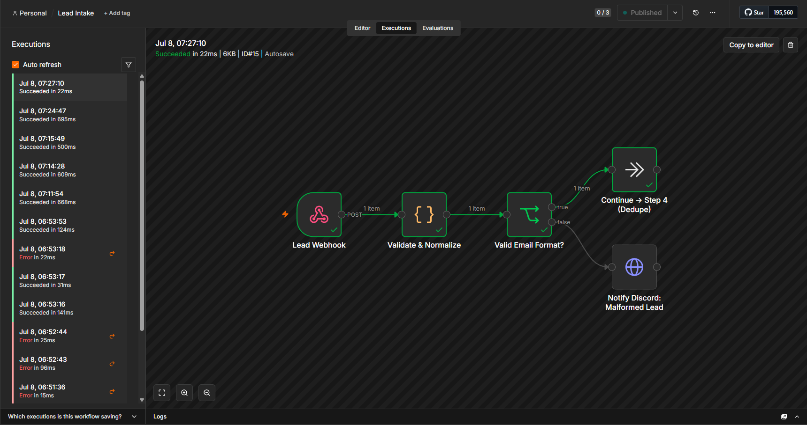
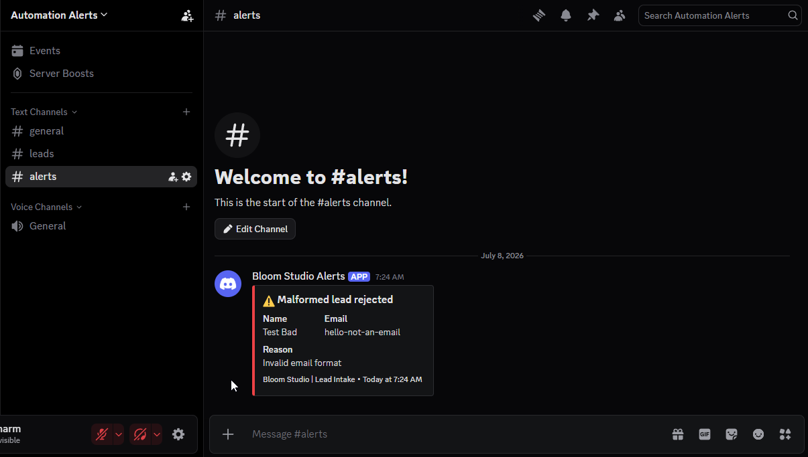

**Airtable dedupe**
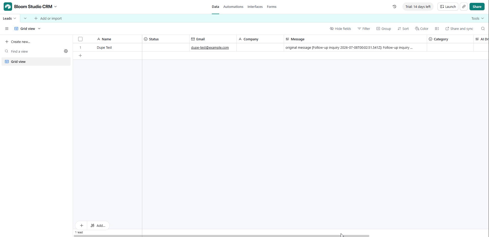
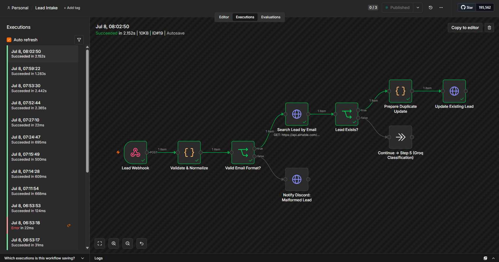

**AI classification**
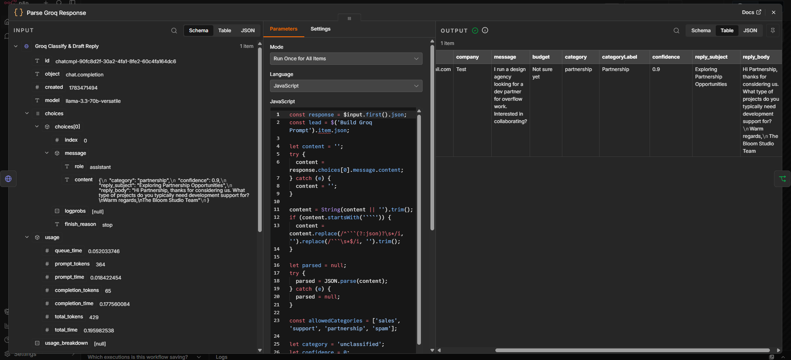
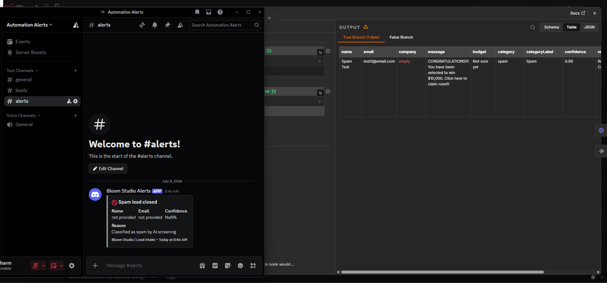

**Save, send, notify**
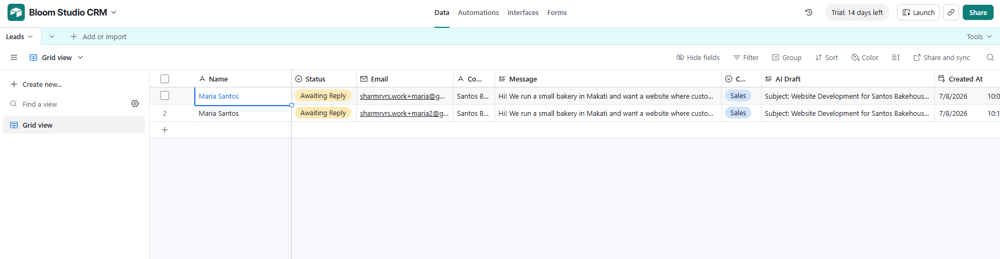
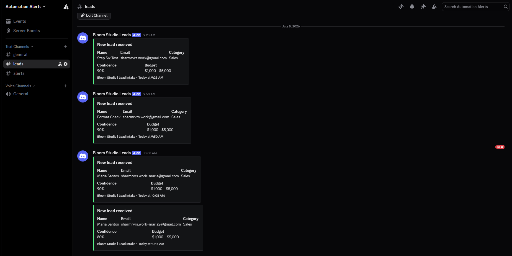
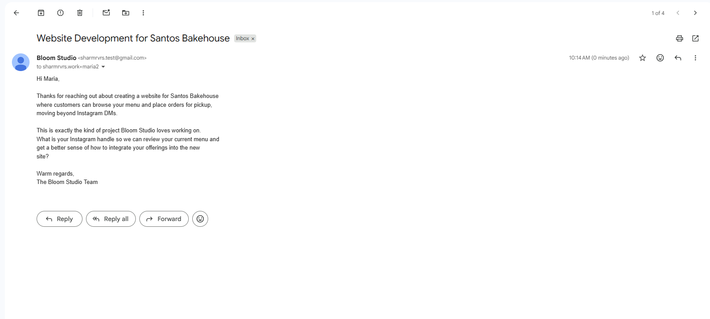

**Scheduled follow-up**
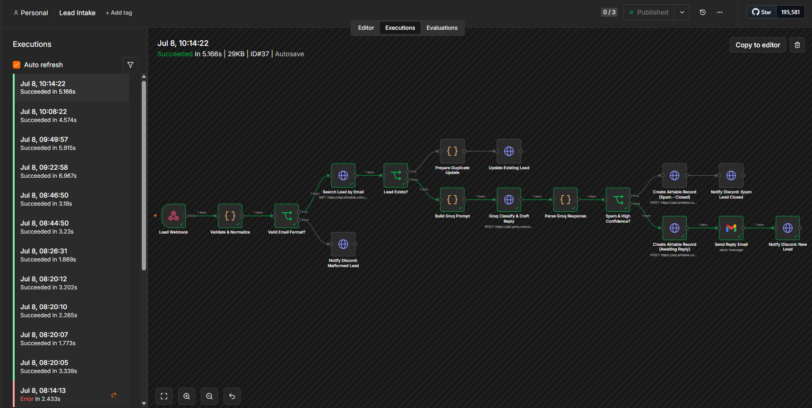
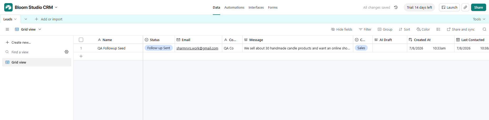
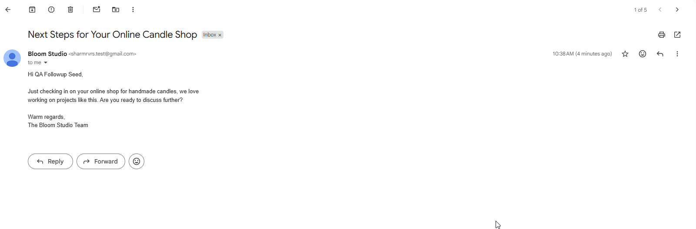

**Production deployment**

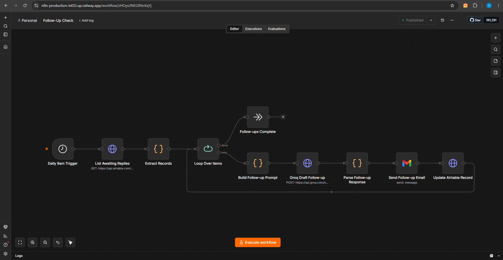
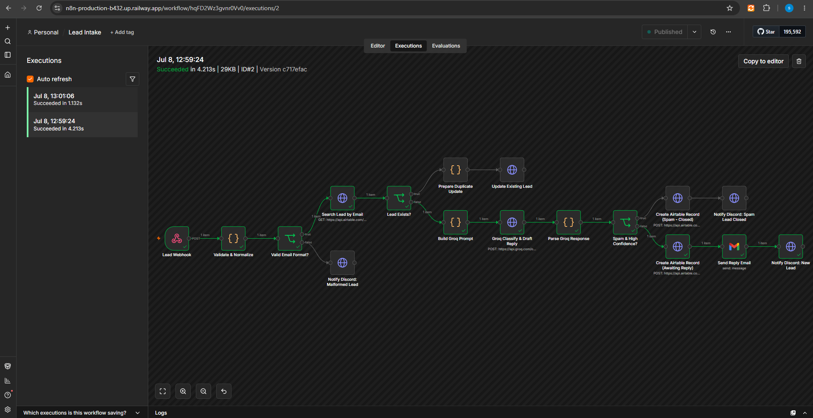
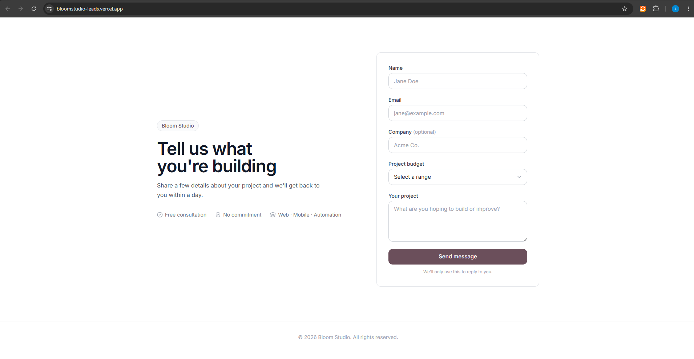

## Skills demonstrated

- n8n workflow design, self-hosted on Docker and deployed to Railway
- Webhook integration with secret-header authentication
- AI automation: LLM classification with structured JSON output (Groq, OpenAI-compatible API)
- Airtable REST API integration and mini-CRM design
- Gmail API integration with OAuth2 credentials
- Discord webhook notifications
- Scheduled workflows with status-based idempotency
- Defensive error handling: safe JSON parsing, spam filtering, deduplication
- Full-stack delivery: a custom Next.js frontend feeding a production automation pipeline
- Production deployment and environment-parity troubleshooting across Railway and Vercel

## Documentation

- [docs/setup-guide.md](docs/setup-guide.md) - full reproduction steps from zero
- [docs/architecture.md](docs/architecture.md) - node-by-node technical walkthrough of both workflows
